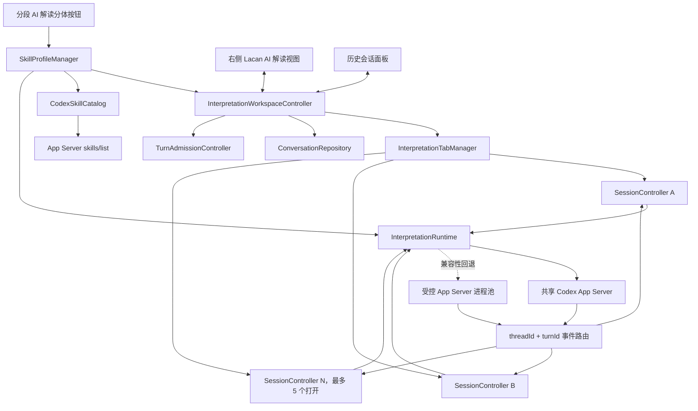

# Lacan Translation Helper 分段 AI 多会话、并发任务与 Skill 触发升级设计

> - 状态：`v0.6.0` 已实现并完成首轮验收
> - 设计日期：2026-07-23
> - 开发分支：`plugin-develop`
> - 所属插件：`Lacan Translation Helper`
> - 依赖运行时：本地 Codex Agent
> - Claudian 运行时依赖：无
> - 会话上限：用户可配置 `1–5`，硬上限为 `5`
> - 默认值：`3`
> - 输入约定：`Enter` 发送，`Shift+Enter` 换行，中文输入法组词时不发送
> - AI 入口：源码编辑模式显示 `Ф`，阅读模式显示 `【分段 ID】 Ф`，不把入口名称绑定为“AI 解读”
> - 配置入口：插件设置中的独立“AI 功能”标签
> - Skill 约定：`Ф` 使用默认功能方案；下拉菜单可为本次新会话指定其他方案

## 1. 文档定位

本文是 [分段 AI 解读功能架构设计](./segment-ai-interpretation-architecture.md) 的第二阶段增量设计，专门解决以下升级：

1. 允许同时打开多个分段解读会话；
2. 允许多个会话中的 Agent 任务同时生成；
3. 在同一个右侧功能栏中切换会话；
4. 提供可恢复、可重命名、可删除的历史会话管理；
5. 支持会话内快速跳转和目录；
6. 改善流式生成期间的滚动跟随体验；
7. 支持按 `Enter` 发送追问；
8. 支持为“AI 解读”按钮自定义或指定要触发的 Codex Skills。

本文不改变第一阶段已经确定的产品边界：

- 仍然是现有 `lacan-translation-helper` 插件的一部分；
- 不创建第二个 Obsidian 插件；
- 仍然使用现有分段识别、原译文对齐、术语和笔记上下文；
- 仍然首先使用本地 Codex Agent；
- 仍然默认只读；
- 默认任务是“术语与符号对照 + 语境性解读”，术语表缺项或不一致只报告、不自动写入；
- 仍然独立于 Claudian，不读取其配置、会话或内部 API；
- 没有配置 Skill 时仍可使用唯一的全局解读提示词；
- 后续 MCP 和远程模型 API 仍通过运行时适配层接入。

本文将替代第一阶段文档中关于“一个逻辑分段只对应一个当前会话”“整个右侧栏只有一个控制器状态”“同一 Vault 同时只运行一个 turn”的限制。第一阶段的上下文、Prompt、权限、模型发现和 MCP 边界继续有效。

### 1.1 UX 审核结论

实现前对方案做一次面向日常阅读的收敛，最终界面方向为：

```text
Quiet editorial instrument / 安静的学术批注工具
```

它不是一个另起炉灶的通用 AI 聊天窗口，而是 Obsidian 阅读界面中的一件学术批注工具。视觉上继承 Obsidian 主题变量和用户字号，以分段 ID、课次、原译文证据和会话文本为主；普通选中、焦点、活动标签和消息标记统一使用 Obsidian 的 `--interactive-accent`，不写死红色或某个紫色色值。失败、不可用和破坏性操作继续使用主题的错误语义色。

本次审核形成以下必须落地的用户体验决策：

1. **默认入口保持一次点击。** 源码编辑模式显示紧凑的 `Ф`，阅读模式为了明确段落归属显示 `【分段 ID】 Ф`；用户没有建立额外 Skill 方案时只显示这一个按钮，存在多个可用 Skill 方案时才显示分体菜单。`Ф` 是通用 AI 入口，不预先限定为“解读”。
2. **高级能力渐进展开。** Skill 发现、配置组合和自定义 Skill 只在插件设置以及按钮的下拉菜单中出现；普通解读路径不要求用户理解 Codex 协议、路径或作用域。
3. **输入框始终可见。** 有活动会话时追问区固定在底部；生成期间允许继续编辑草稿，只禁用提交。失败、停止或空回答之后也不能让输入框和会话控制一起消失。
4. **错误归属于单个会话。** 某一任务失败只在其标签和消息区显示错误；其他会话的切换、停止、发送和历史操作保持可用。
5. **草稿和阅读位置属于会话。** 切换标签不会丢失未发送内容，也不会把另一个会话的滚动位置套用过来。
6. **历史管理不遮掉当前答案。** 历史使用右侧栏内的轻量抽屉或浮层；打开历史、重命名和关闭标签不需要离开当前阅读上下文。
7. **关闭与删除用词明确。** “关闭”只移出顶部标签并保留历史；“删除”才移除插件保存的历史记录。正在生成时提供“停止并关闭”，不使用含糊的确认文案。
8. **自动跟随可预测。** 默认看最新内容；用户向上阅读后立即停止抢滚动位置，并显示“回到最新”；切换回来时恢复该会话原有选择。
9. **会话导航是辅助控件。** 五个跳转按钮仅在内容确实溢出时显示，默认低强调；目录直接来自用户提问记录，而不是扫描回答中的 Markdown 标题。
10. **状态用自然语言表达。** 设置页和错误卡片优先说“会话上限”“正在生成”“这个 Skill 已不可用”，协议名和错误码只放在诊断细节中。

为了避免第一版同时出现过多入口，实施顺序进一步收敛为：

- 先完成全局提示词解读的多会话、并发、历史、输入和导航闭环；
- 随后在同一数据模型上接入 Skill 清单、指定配置和自定义 Vault Skill；
- 自定义 Skill 第一版只管理一个 `SKILL.md`，不在插件里制作复杂资源目录；
- 不用功能尚未完成的占位按钮进入正式界面。

上述收敛不删减用户提出的能力，只调整暴露顺序和默认界面密度。

## 2. 需求重新定义

### 2.1 四个容易混淆的概念

本次升级必须先区分以下四种对象：

| 概念 | 定义 | 是否受 `1–5` 设置限制 |
| --- | --- | --- |
| 会话 `Conversation` | 一组可持续追问、可恢复的消息及其 Agent thread | 否，历史会话可以长期保留 |
| 打开的会话 `Open tab` | 当前右侧栏工作区中可直接切换的会话槽位 | 是 |
| 任务 `Turn` | 某个会话中正在执行的一次初始解读或追问 | 是 |
| 历史记录 `History` | 已保存但不一定处于打开状态的会话 | 否 |

因此，“会话上限 5 个”不表示最多只能保存 5 条历史记录，而是：

- 同时打开的会话最多 5 个；
- 同时执行的 Agent turn 最多 5 个；
- 每个会话同一时刻最多执行 1 个 turn；
- 已关闭到历史中的会话不占打开槽位；
- 历史记录数量不受该设置直接限制。

### 2.2 设置项

插件管理页分为“项目与同步”和“AI 功能”两个标签。以下设置集中放在独立的“AI 功能”标签中：

| 设置 | 建议字段 | 范围 | 默认值 | 说明 |
| --- | --- | --- | --- | --- |
| 同时打开的会话数 | `segmentAiMaxOpenSessions` | `1–5` | `3` | 同时也是第二阶段的最大并发 turn 数 |
| 默认 Skill 方案 | `segmentAiDefaultSkillProfileId` | 已保存方案或不附加 Skill | 不附加 Skill | 单击 `Ф` 时使用 |
| 自定义 Skill 保存位置 | `segmentAiCustomSkillRoot` | `.agents/skills` 或 `.codex/skills` | `.agents/skills` | 只影响用户明确创建的 Vault Skill |

设置界面采用数字下拉或步进控件，只显示 `1、2、3、4、5`，不允许自由填写任意整数。

读取旧配置或异常配置时必须归一化：

```text
normalized = min(5, max(1, integer(value) or 3))
```

如果用户把上限从 5 调低到 2，而当前已经打开 4 个会话：

- 不强行关闭任何会话；
- 不停止任何正在生成的任务；
- 保留这 4 个会话的切换能力；
- 禁止再打开或新建会话，直到打开数量降到 2 以下；
- 设置页和会话栏显示“当前已打开 4 个，上限已改为 2；先关闭到 2 个以内，如需新建还要留出一个空槽位”的说明。

## 3. 核心架构决策

| 编号 | 决策 | 说明 |
| --- | --- | --- |
| ADR-MS-001 | 上限约束打开槽位，不约束历史总数 | 否则无法形成真正的历史管理 |
| ADR-MS-002 | 设置范围固定为 `1–5`，默认 `3` | 兼顾阅读体验、资源消耗和用户明确要求 |
| ADR-MS-003 | 一个会话同一时刻只允许一个 turn | 避免同一 thread 中回答次序和上下文相互覆盖 |
| ADR-MS-004 | 不同会话可以同时生成 | 每个任务独立停止、失败和完成 |
| ADR-MS-005 | 优先复用一个 Vault 级 App Server | 通过 `threadId + turnId` 路由并发事件 |
| ADR-MS-006 | 并发协议验证不通过时使用受控进程池 | UI 和领域层不感知底层是一进程还是多进程 |
| ADR-MS-007 | 会话、标签页和 Codex thread 使用不同 ID | 避免把 UI 生命周期绑定到运行时 ID |
| ADR-MS-008 | 关闭标签页不删除历史 | “关闭”和“删除”必须是两个动作 |
| ADR-MS-009 | 正在生成的会话不能被静默关闭 | 必须先停止，或明确确认“停止并关闭” |
| ADR-MS-010 | 切换会话不停止后台任务 | 完成后为非当前会话显示提醒标记 |
| ADR-MS-011 | 按钮和回车共用同一个提交入口 | 防止两套校验和状态处理不一致 |
| ADR-MS-012 | 默认自动跟随最新内容 | 用户主动上滑后暂停跟随，避免抢夺滚动位置 |
| ADR-MS-013 | 会话目录以“用户提问”为锚点 | 初始解读请求和每次追问构成目录节点 |
| ADR-MS-014 | 参考 Claudian 的交互语义，不复制其状态 | 插件运行时不读取 `.claudian/` 或 Claudian 私有代码 |
| ADR-MS-015 | 第二阶段不引入隐式任务队列 | 达到上限时明确提示并保留用户输入，不在后台偷偷排队 |
| ADR-MS-016 | Skill 清单以 App Server `skills/list` 为准 | 不用插件自行扫描结果冒充 Codex 实际可用清单 |
| ADR-MS-017 | Skill 使用结构化 `SkillUserInput` 传给 turn | 不只是在文本提示词前拼接 `$skill-name` |
| ADR-MS-018 | 主按钮使用默认 Skill 配置，下拉菜单允许本次覆盖 | 保持一键操作，同时支持针对性解读 |
| ADR-MS-019 | Skill 配置在创建会话时固定 | 后续追问默认继承；更换配置应新建会话 |
| ADR-MS-020 | Skill 永远不能覆盖只读、路径和外部工具边界 | Skill 负责分析方法，不负责提升权限 |
| ADR-MS-021 | Skill 缺失或失效时不静默回退 | 在启动 turn 前提示用户刷新、改选或使用“不附加 Skill” |
| ADR-MS-022 | 来源文本中的 `$xxx` 不触发 Skill | 只有用户在插件 UI 中明确选择的 Skill 才能进入结构化输入 |

## 4. 对 Claudian 的参考范围

本设计参考的是本机 Claudian `2.0.39` 的用户体验和状态划分，而不是把 Claudian 变成依赖。

### 4.1 采用的交互原则

Claudian 中值得沿用的部分：

1. 打开的会话与全部历史记录分离；
2. 顶部以编号标签切换多个会话；
3. 每个标签显示标题、运行状态和是否需要关注；
4. 历史记录如果已经打开，点击后切换到已有标签，不重复打开；
5. 已关闭的历史记录可以在当前槽位、新前台槽位或后台槽位打开；
6. 关闭标签后保留历史；
7. 打开的标签和当前活动标签可以在重启后恢复；
8. 历史记录按最近回答时间排序；
9. 会话内部提供置顶、上一问、目录、下一问、置底导航。

### 4.2 五个会话跳转按钮的真实语义

从上到下依次为：

| 图标 | 行为 | 本插件采用的语义 |
| --- | --- | --- |
| 双上箭头 | 平滑滚动到会话顶部 | 置顶，并退出“自动跟随最新” |
| 单上箭头 | 跳到上一条用户消息 | 跳到上一个初始请求或追问锚点 |
| 树状列表 | 打开会话目录 | 显示所有用户提问的编号和摘要 |
| 单下箭头 | 跳到下一条用户消息 | 跳到下一个初始请求或追问锚点 |
| 双下箭头 | 平滑滚动到会话底部 | 置底，并重新开启“自动跟随最新” |

这里的“上一条/下一条消息”明确指用户提问，不是逐个 AI 文本块、工具事件或 Markdown 标题跳转。

会话目录的标题来源优先级为：

1. 消息记录中的显式目录标题；
2. 用户提问的单行摘要；
3. 初始任务使用 `分段 ID · 初始解读`。

### 4.3 有意不照搬的部分

本插件做以下领域化调整：

- 标签标题优先显示分段 ID 和课次，不依赖额外 AI 生成标题；
- 上限按用户要求固定为 `1–5`，不采用 Claudian 的其他范围；
- 目录直接读取会话消息模型，不通过 DOM 查询反推消息；
- 正在生成的标签不能被一次点击静默关闭；
- 历史记录保留分段、译文路径、上下文版本和过期原因；
- 不读取 Claudian 的 `maxTabs`、session metadata 或 provider state；
- 不要求用户安装或启用 Claudian。

### 4.4 Codex Skill 发现与调用参考

Claudian 对 Codex Skills 的处理提供了两个值得参考的边界：

1. 通过 App Server `skills/list` 获取 Codex 对当前工作目录实际发现的 Skill；
2. 把用户明确选中的 Skill 解析为结构化输入，而不是只依赖普通文本中的 `$name`。

本机 `codex-cli 0.144.5` 生成的 App Server schema 已确认：

```ts
skills/list({
  cwds: [vaultRoot],
  forceReload?: boolean,
});
```

返回的 Skill metadata 包含：

- `name`；
- `description`；
- `path`；
- `scope`：`repo | user | system | admin`；
- `enabled`；
- 可选的 interface、dependencies 和错误信息。

`turn/start` 中的 Skill 输入为：

```ts
{
  type: "skill",
  name: "translate-lacan-seminars",
  path: "/resolved/path/to/SKILL.md",
}
```

当前 Vault 已存在：

- `.agents/skills/translate-lacan-seminars/SKILL.md`；
- `.agents/skills/humanizer-zh/SKILL.md`。

它们只作为当前可验证样例，不被硬编码成插件内置清单。插件启动后仍以 `skills/list` 的实时结果为准。

## 5. 右侧栏总体布局

```text
┌──────────────────────────────────────────────┐
│ Lacan AI 解读                    历史   ＋   │
│ [1 s8-15-0013 ●] [2 s8-15-0014 ✓] [3 ...] │
├──────────────────────────────────────────────┤
│ 当前会话标题 / 分段 / Skill / 模型 / 推理强度│
│ [译文] [法文] [停止或重新解读]               │
├──────────────────────────────────────────────┤
│                                              │
│ 会话消息与流式回答                      ⇈    │
│                                         ↑    │
│                                         ☷    │
│                                         ↓    │
│                                         ⇊    │
│                                              │
│                           [回到最新 · 3]      │
├──────────────────────────────────────────────┤
│ 继续追问……                                  │
│ Enter 发送 · Shift+Enter 换行        [发送] │
└──────────────────────────────────────────────┘
```

### 5.1 顶部会话栏

每个标签至少包含：

- 槽位编号；
- 会话标题；
- 当前状态图标；
- 非当前会话完成后的“需要关注”标记；
- 关闭按钮。

状态图标建议：

| 状态 | 表现 |
| --- | --- |
| 未开始/可追问 | 无图标或空心圆 |
| 正在解析上下文 | 小型旋转图标 |
| 正在生成 | 动态圆点或旋转图标 |
| 已完成 | 对勾 |
| 已停止 | 暂停/中断图标 |
| 失败 | 主题错误色感叹号 |
| 内容已过期 | 黄色提示点 |
| 后台完成未查看 | 紫色实心提醒点 |

标签过多时横向滚动，不压缩到无法辨认。编号在当前打开集合中按显示顺序生成，不作为持久 ID。

### 5.2 新会话与分段按钮

“新会话”不等于立刻创建一个无上下文的通用聊天。它有两种入口：

1. 在译文某个分段点击“AI 解读”，以该分段创建会话；
2. 在当前分段会话中选择“新会话重新解读”，为同一分段保留一条新的独立历史。

分段控件使用分体按钮：

```text
[ AI 解读 ][ ▾ ]
```

- 单击“AI 解读”：使用插件设置中的默认 Skill 配置；
- 单击下拉箭头：选择“不附加 Skill”或任一已保存的 Skill 配置；
- 选择“管理解读配置”：打开插件设置；
- 选择不同配置不会修改同一分段已有会话，而是恢复匹配配置的历史或新建会话。

点击分段“AI 解读”时按以下顺序处理：

1. 确定本次使用的 `skillProfileId`；
2. 如果该分段与该 Skill 配置已有打开的当前会话，直接切换；
3. 如果有已打开但内容或 Skill 已过期的会话，切换并提示重新解读；
4. 如果历史中有同一分段、同一 Skill 配置的最近一次可恢复会话且尚未打开，恢复为一个标签；
5. 如果没有历史，则创建新会话并开始初始解读；
6. 如果已经达到打开上限，不替换、不关闭、不停止任何会话，只显示会话管理提示。

达到上限时提供三个明确动作：

- 切换到某个已经打开的会话；
- 关闭一个空闲会话后再打开；
- 如果当前会话空闲，选择“在当前槽位打开”，将当前会话关闭到历史后打开目标。

不自动覆盖含有未发送草稿的会话。

### 5.3 切换行为

切换标签时：

- 后台生成继续；
- 当前标签的输入草稿保留；
- 当前标签的滚动状态保留；
- 新标签恢复自己的滚动状态；
- 只渲染活动标签的完整消息 DOM；
- 非活动标签只更新领域状态、缓存答案和提醒标记；
- 切换到刚完成的标签后清除“需要关注”标记。

## 6. 会话内导航与滚动

### 6.1 导航栏显示条件

导航按钮浮动在消息区右侧，仅当：

```text
scrollHeight > clientHeight + 50px
```

时显示。默认低透明度，悬停或键盘聚焦时提高可见度，避免长期遮挡文本。

所有跳转使用平滑滚动；流式自动跟随不使用连续的平滑动画。

### 6.2 用户提问锚点

以下消息进入会话目录：

- 初始分段解读请求；
- 每次用户继续追问；
- 用户明确发出的重新分析指令。

以下内容不进入目录：

- AI 回答中的 Markdown 标题；
- 工具调用或状态提示；
- 错误卡片；
- “正在生成”“已停止”等系统状态。

上一问/下一问的定位规则：

- 以当前消息区 `scrollTop` 为基准；
- 使用约 `30px` 容差，防止重复定位到屏幕边缘的同一锚点；
- 没有更上一问时回到顶部；
- 没有更下一问时回到底部并重新开启自动跟随。

### 6.3 自动跟随最新内容

每个打开标签都有独立的滚动状态：

```ts
interface SessionScrollState {
  followLatest: boolean;
  scrollTop: number;
  anchorMessageId?: string;
  anchorOffset?: number;
  unseenMessageCount: number;
}
```

规则如下：

1. 新会话默认 `followLatest = true`；
2. 开始生成后默认保持在底部，使最新内容可见；
3. 流式增量到达时，同一动画帧内只渲染最后一份累计 Markdown，并且最多执行一次底部同步；
4. 自动跟随使用即时位置更新，不为每个 token 叠加 `smooth` 动画；
5. 用户主动向上滚动并离底部超过 `20px` 后，立即设置 `followLatest = false`；
6. 暂停跟随后，流式内容继续生成，但绝不写入 `scrollTop`，由用户完全控制滚动位置；
7. 新内容到达时显示“回到最新 · N”；
8. 点击“回到最新”或双下箭头后，滚到底部并恢复跟随；
9. 点击置顶、上一问或目录条目后，关闭自动跟随；
10. 用户拖回底部时不立即抢回控制；只有在底部附近稳定保持 `150ms` 后才恢复自动跟随；
11. 切换会话时分别保存和恢复各自的滚动位置。

上述 `20px` 底部判定阈值和 `150ms` 恢复等待时间通过常量集中管理。这一“立即暂停、延迟恢复”的非对称规则用于避免拖动滚动条时在边界附近反复切换状态。

### 6.4 为什么流式跟随不能一直使用 smooth

模型可能在短时间内产生大量增量。如果每次增量都调用：

```js
scrollTo({ top: scrollHeight, behavior: "smooth" })
```

浏览器会不断叠加或打断滚动动画，表现为滚动条抖动、滞后，甚至用户无法稳定上滑。

正确策略是：

- 用户主动点击导航时使用平滑滚动；
- 流式生成时通过 `requestAnimationFrame` 同时合并 Markdown 重渲染和位置更新；
- 只在 `followLatest = true` 时写入滚动位置；
- 用户一旦离开底部立即停止自动滚动，回到底部稳定一小段时间后才恢复。

## 7. 输入与发送设计

### 7.1 键盘行为

| 操作 | 行为 |
| --- | --- |
| `Enter` | 发送当前追问 |
| `Shift+Enter` | 插入换行 |
| 中文输入法正在组词时按 `Enter` | 只确认候选词，不发送 |
| 空白内容按 `Enter` | 不发送，不创建消息 |
| 当前会话仍在生成时按 `Enter` | 不发送，保留草稿，提示该会话仍在生成 |
| 已达到全局并发上限时按 `Enter` | 不发送，保留草稿，提示并发上限 |
| 点击“发送”按钮 | 与 `Enter` 完全相同 |

输入框下方固定显示：

```text
Enter 发送 · Shift+Enter 换行
```

### 7.2 中文输入法保护

仅检查 `event.key === "Enter"` 不够。Electron/Chromium 中必须同时维护 composition 状态：

```ts
let isComposing = false;

onCompositionStart(() => {
  isComposing = true;
});

onCompositionEnd(() => {
  isComposing = false;
});

onKeyDown((event) => {
  if (event.key !== "Enter") return;
  if (event.shiftKey) return;
  if (event.isComposing || isComposing || event.keyCode === 229) return;
  event.preventDefault();
  submitFollowUp();
});
```

`keyCode === 229` 只作为 Electron 输入法兼容保护，不作为主要判断。

### 7.3 单一提交路径

回车和按钮必须调用同一个 `submitFollowUp()`，统一完成：

1. 读取并规范化输入；
2. 校验当前会话是否存在；
3. 校验同会话是否已有运行中 turn；
4. 原子申请全局并发槽位；
5. 追加用户消息；
6. 启动运行时 turn；
7. 确认启动成功后清空草稿；
8. 更新会话目录和滚动状态；
9. 失败时释放槽位并保留可恢复状态。

如果失败发生在运行时接受任务之前，输入草稿不能被清空。

如果运行时已经接受任务、用户消息已经进入会话，后续生成失败，则保留该用户消息并显示对应错误，不把问题重新塞回输入框。

### 7.4 生成期间的输入

建议输入框在生成期间仍允许编辑草稿，但发送按钮不可用。这样用户可以提前准备下一问，同时保持“同一会话一次只有一个 turn”的约束。

停止当前回答或回答完成后，草稿可以立即发送。

## 8. AI 解读按钮的 Skill 配置

### 8.1 目标与边界

Skill 能力解决的是“用什么分析方法解读这一段”，而不是“是否允许 Agent 获得更多权限”。

用户需要同时获得两种能力：

1. 指定现有 Skill：从本机 Codex 对当前 Vault 实际发现的 Skill 中选择；
2. 自定义 Skill：在插件设置中明确创建一个标准 Vault 级 `SKILL.md`，然后把它加入解读配置。

所有按钮和会话共用设置页中的唯一一份“解读提示词”。没有选择任何 Skill 时，按钮只发送这份全局提示词和插件解析出的分段上下文。

默认全局提示词先执行术语识别和术语表一致性核对，再执行语境性解读。术语表未收录时只给出候选译法与理由；与术语表不一致时并列展示差异，由用户决定是否另行修改。

Skill 不得改变以下不可覆盖约束：

- Agent 仍是只读；
- 术语表只允许读取和对照，不允许 Agent 自动收录或修改；
- `approvalPolicy` 仍为 `never`；
- 工作目录仍限定为 Vault；
- Web Search、Apps、Plugins 和 MCP 仍按第一阶段策略关闭；
- 来源文本中的指令仍被视为不可信资料；
- 插件确定性解析的分段、原译文和术语上下文仍然存在。

### 8.2 一份全局提示词，Skill 配置只管理 Skill

提示词不属于 `SkillProfile`。插件设置只保存一个 `interpretationPrompt`；每个 `SkillProfile` 只描述要结构化附加的 Skill：

```ts
interface SkillProfile {
  id: string;
  title: string;
  primarySkill?: SkillSelector;
  supportingSkills: SkillSelector[];
  createdAt: string;
  updatedAt: string;
}

interface SkillSelector {
  name: string;
  scope: "repo" | "user" | "system" | "admin";
  repoRelativePath?: string;
}
```

第一实现每个配置允许：

- 0 或 1 个主要 Skill；
- 0–2 个辅助 Skills；
- 一个用户可读的配置名称。

如果需要组合更多复杂步骤，应创建一个组合型自定义 Skill，而不是无限叠加多个可能冲突的 Skills。

内置且不可删除的配置：

```text
不附加 Skill
```

它不附加 Skill，只使用全局解读提示词。

旧版 `additionalInstruction` 的迁移规则：

- 如果当前默认方案含有旧的补充提示词，把它迁移为唯一全局提示词；
- 如果只有一条非空旧提示词，也迁移该文本；
- 纯提示词方案迁移后删除，避免保留多个等价按钮；
- 含 Skill 的方案保留 Skill 选择，但丢弃方案级提示词字段；
- 历史回答继续保留，不改写已有内容。

### 8.3 全局提示词与内部安全边界

全局提示词允许用户直接定义回答重点、篇幅和组织方式。无论提示词如何修改，以下内容仍由插件固定注入：

- 当前分段和历史合并 ID；
- 法文原文、译文、前后文、术语和笔记；
- 资料与指令隔离标签；
- 引用路径和分段 ID 要求；
- 只读与外部工具限制。

提示词内容参与 `promptVersion`。用户修改后，旧会话仍可阅读，但再次打开或追问时会提示“提示词已变化”，要求通过“重新解读”创建新会话。

### 8.4 Skill 发现

插件不把目录扫描结果直接当作可执行清单，而是调用：

```ts
skills/list({
  cwds: [vaultRoot],
});
```

处理规则：

1. 只显示 `enabled = true` 的条目；
2. 展示名称、说明和作用域；
3. 同名 Skill 必须显示来源，不能让用户猜实际选中哪一个；
4. Vault/repo Skill 标记为“随项目”；
5. user Skill 标记为“仅本机”；
6. system/admin Skill 可选择但不可由插件编辑；
7. App Server 返回错误信息的 Skill 标记为不可用；
8. 收到 `skills/changed` 后使清单缓存失效；
9. 用户点击“刷新”时使用 `forceReload: true`。

当前项目约定优先使用：

```text
.agents/skills/<skill-name>/SKILL.md
```

同时兼容：

```text
.codex/skills/<skill-name>/SKILL.md
```

插件不在第一实现中调用 `skills/extraRoots/set` 添加任意外部目录，避免扩大 Vault 读取边界。

### 8.5 自定义 Skill

插件设置页提供“新建自定义 Skill”，只创建标准 Vault Skill：

```text
名称
说明
指令正文
保存目录：.agents/skills / .codex/skills
```

默认保存到 `.agents/skills`，与当前项目约定一致。

安全规则：

- Skill 名称只允许 ASCII 字母、数字、短横线和下划线；
- 名称中禁止 `/`、`\`、`..` 和绝对路径；
- 目标必须规范化后仍位于选定的 Vault Skill 根目录；
- 已有同名目录不能静默覆盖；
- frontmatter 的 `name` 必须与目录名一致，`description` 和指令正文不能为空；
- 只允许编辑 `skills/list` 确认为 `scope=repo` 且位于这两个根目录内的 Skill；
- user、system、admin Skill 在插件中只读；
- 保存和删除都属于用户在设置页明确发起的管理操作；
- Agent turn 本身仍不能创建或修改 Skill；
- 删除自定义 Skill 必须二次确认；
- 删除 Skill 不自动删除引用它的历史会话。

第一实现的编辑器只管理 `SKILL.md`。包含 `scripts/`、`references/`、`assets/` 等复杂资源的 Skill 仍由用户在文件系统或其他 Skill 工具中维护。

保存后必须：

1. 调用 `skills/list({ forceReload: true })`；
2. 确认 Codex 返回同名、同作用域 Skill；
3. 只有确认成功后才允许加入按钮配置；
4. 如果 Codex 没有发现，显示真实错误，不能仅因文件写入成功就宣称可用。

> 这里的文件写入是用户点击“保存 Skill”产生的显式管理操作，与 AI 解读 turn 的只读边界是两回事。

### 8.6 按钮选择与优先级

设置页允许：

- 直接编辑全插件唯一的解读提示词；
- 选择主按钮的默认 `SkillProfile`；
- 新建和删除 Skill 配置；
- 调整主要 Skill 和辅助 Skills；
- 查看每个 Skill 的作用域和可用状态。

分段按钮的行为：

```text
[ AI 解读 ][ ▾ ]
```

主按钮优先级：

1. 用户本次从下拉菜单明确选择的配置；
2. 插件设置中的默认配置；
3. 内置“不附加 Skill”。

第三层只是“未配置默认值”的正常兜底。已经明确选择的配置如果缺失或失效，禁止静默回退。

下拉菜单建议显示：

```text
✓ 不附加 Skill
  拉康研讨班文本校核      $translate-lacan-seminars
  自然中文辅助            $humanizer-zh
  ─────────────────
  管理解读配置…
  刷新 Skills
```

菜单展示的是配置名称；Skill 名称作为辅助信息。这样一个配置可以组合主要和辅助 Skills，而不把复杂实现暴露为一串路径。

### 8.7 结构化调用

插件先根据 `SkillProfile` 解析所有 Skill，再构造 `turn/start` 输入：

```ts
const input = [
  {
    type: "skill",
    name: primary.name,
    path: primary.path,
  },
  ...supporting.map((skill) => ({
    type: "skill",
    name: skill.name,
    path: skill.path,
  })),
  {
    type: "text",
    text: interpretationPrompt,
  },
];
```

路径只能来自本次 `skills/list` 返回的 metadata，不接受配置文件中的任意绝对路径。

解析流程：

```text
读取 SkillProfile
    ↓
从 skills/list 清单按 name + scope 解析
    ↓
核对 enabled、path 和依赖
    ↓
生成 SkillUserInput[]
    ↓
附加插件的文本 Prompt
    ↓
turn/start
```

文本输入始终只有全局 `interpretationPrompt` 一份；Skill 方案不得再拼接、保存或迁移出第二份运行时提示词。

### 8.8 不解析来源文本中的 `$skill`

以下内容即使出现 `$humanizer-zh` 或其他名称，也不能触发 Skill：

- 法文原文；
- 中文译文；
- 阅读笔记；
- 术语表；
- Agent 工具输出；
- 用户普通追问文本。

只有插件 UI 中明确选中的 `SkillProfile` 才能产生 `{type:"skill"}` 输入。

这样可以避免：

- 原文或笔记通过提示词注入启用额外工作流；
- 用户引用一段包含 `$name` 的资料时误触发 Skill；
- Skill 调用记录与实际 UI 选择不一致。

未来如果要支持在追问输入框中临时附加 `$skill`，必须设计显式的选择器和确认状态，不能直接对自由文本做正则后自动启用。

### 8.9 会话继承与更换

会话创建后固定以下内容：

- `skillProfileId`；
- 主要和辅助 Skill 的名称、作用域；
- repo Skill 的 Vault 相对路径，或非 repo Skill 的路径 fingerprint；
- Skill 文件 fingerprint；
- 应用模式；
- 补充要求；
- 当次 Prompt 版本。

后续追问默认继承同一配置。

不允许在已有 thread 中无提示地切换 Skill 配置。用户选择另一个配置时：

- 默认创建新会话；
- 原会话保留在历史；
- 新旧结果可以并列切换比较；
- 同一分段、不同配置允许同时运行，仍受总并发上限约束。

历史索引因此按：

```text
segmentKey + skillProfileId
```

查找最近会话，但它们仍不是唯一键。

### 8.10 Skill 更新

会话只保存 Skill identity/fingerprint，不复制整份外部 Skill 内容。

- repo/Vault Skill：可以在 Vault 边界内对 `SKILL.md` 计算内容 fingerprint；
- user/system/admin Skill：不由插件越过 Vault 主动读取正文，只保存 App Server metadata identity，并在 `skills/changed` 后重新解析；
- 如果未来 App Server metadata 提供版本或内容摘要，优先使用协议字段。

每次新 turn 前重新解析 Skill：

- repo Skill fingerprint 未变化：正常继续；
- repo Skill 内容已变化：显示“该 Skill 已更新”；
- 非 repo Skill 在 catalog 失效后重新确认 name、scope 和 path；无法确认精确内容版本时不声称已做内容级比较；
- 用户可以选择“按新版继续”或“使用新版新建会话”；
- Skill 已移动、禁用或删除：阻止启动并显示 `SkillUnavailable`；
- 不能在找不到原 Skill 时静默使用同名但不同作用域的 Skill。

如果用户选择“按新版继续”，会话记录追加一次配置变更事件，并更新 fingerprint，便于理解同一会话前后方法可能不同。

### 8.11 兼容性与依赖

插件不能仅凭 Skill 名称判断它是否适合解读。设置页至少区分：

| 状态 | 含义 | 行为 |
| --- | --- | --- |
| 可用 | Codex 已发现且依赖满足 | 可选择 |
| 受限 | Skill 含编辑型流程，但只读运行时仍可加载 | 可选择并显示提示 |
| 依赖不可用 | 依赖当前已禁用的 MCP、App、网络或其他能力 | 禁止启动 |
| 无效 | metadata 或文件解析失败 | 禁止选择 |
| 已丢失 | 配置引用但当前清单不存在 | 保留配置，禁止启动 |

例如：

- `translate-lacan-seminars` 本身明确包含只读解释模式，可以作为研讨班分析方法使用；
- `humanizer-zh` 主要面向编辑与改写，在解读场景中应标记为“受限/可能改变表达风格”；
- 即使 Skill 声明允许 Write/Edit，运行时也不会因此获得写权限；
- 依赖当前禁用 MCP 的 Skill 不能假装完整执行。

### 8.12 错误与回退

新增错误码：

| 错误码 | 含义 | 是否启动 turn |
| --- | --- | --- |
| `SkillProfileNotFound` | 配置已被删除或损坏 | 否 |
| `SkillUnavailable` | Skill 缺失、禁用或路径无法解析 | 否 |
| `SkillDependencyUnavailable` | 所需能力被当前只读策略禁用 | 否 |
| `SkillChanged` | Skill identity 或 repo fingerprint 与会话记录不同，等待用户决定 | 否 |
| `SkillInvocationRejected` | App Server 不接受结构化 Skill 输入 | 否 |

错误卡片提供：

- 刷新 Skills；
- 编辑配置；
- 使用“不附加 Skill”；
- 使用当前 Skill 新建会话；
- 复制脱敏诊断。

选择“使用不附加 Skill”是新的明确用户操作，不是静默回退。

## 9. 领域模型

### 9.1 ID 分工

| ID | 生命周期 | 用途 |
| --- | --- | --- |
| `conversationId` | 插件持久化 | 一条历史会话的稳定主键 |
| `tabId` | 工作区持久化 | 一个打开槽位的主键 |
| `segmentKey` | 内容持久化 | `translationPath::primaryId`，定位分段 |
| `threadId` | 运行时持久化 | Codex Agent thread 标识 |
| `turnId` | 单次运行 | 一次 Agent turn 标识 |
| `messageId` | 会话持久化 | 消息、目录和滚动锚点标识 |
| `skillProfileId` | 插件持久化 | 一个按钮解读配置的稳定主键 |

必须避免以下错误：

- 不能把 `segmentKey` 当成 `conversationId`，因为同一分段可以重新解读多次；
- 不能把 `threadId` 当成标签页 ID，因为运行时 thread 可能失效或重建；
- 不能用标签编号作为持久 ID，因为标签顺序会变化。

### 9.2 插件设置

```ts
interface SegmentAiSettingsV2 {
  maxOpenSessions: 1 | 2 | 3 | 4 | 5;
  interpretationPrompt: string;
  defaultSkillProfileId: string;
  customSkillRoot: ".agents/skills" | ".codex/skills";
  skillProfiles: SkillProfile[];
}
```

`interpretationPrompt` 是唯一可编辑提示词，空值回退到插件默认值。`defaultSkillProfileId` 不存在、损坏或为空时，使用不可删除的 `standard`（不附加 Skill）配置。模型、推理强度、Codex 路径等继续使用第一阶段的现有设置。

### 9.3 工作区状态

```ts
interface InterpretationWorkspaceState {
  schemaVersion: 2;
  openTabs: Array<{
    tabId: string;
    conversationId: string;
    draft: string;
    scroll: SessionScrollState;
  }>;
  activeTabId?: string;
}
```

工作区只保存“目前打开什么”和 UI 恢复信息，不保存完整历史消息。

### 9.4 会话记录

```ts
interface InterpretationConversationRecord {
  id: string;
  title: string;

  segmentKey: string;
  requestedId: string;
  primaryId: string;
  mergedIds: string[];
  translationPath: string;
  lessonLabel?: string;

  contextHash: string;
  promptVersion: string;
  threadId?: string;

  model?: string;
  reasoningEffort?: string;

  skillProfile: {
    id: string;
    title: string;
    skills: Array<{
      name: string;
      scope: "repo" | "user" | "system" | "admin";
      repoRelativePath?: string;
      resolvedPathFingerprint: string;
      fingerprint?: string;
      fingerprintKind: "content" | "metadata";
      role: "primary" | "supporting";
    }>;
  };

  status: ConversationStatus;
  createdAt: string;
  updatedAt: string;
  lastOpenedAt?: string;
  lastResponseAt?: string;

  messages: ConversationMessage[];
  currentAnswer: string;
  activeTurn?: {
    turnId: string;
    startedAt: string;
  };

  staleReasons?: Array<"context" | "prompt" | "runtime" | "skill">;
  needsAttention?: boolean;
  lastError?: {
    code: string;
    message: string;
    diagnostic?: string;
  };
}
```

### 9.5 消息记录

```ts
interface ConversationMessage {
  id: string;
  role: "user" | "assistant" | "system";
  content: string;
  createdAt: string;
  status: "streaming" | "completed" | "interrupted" | "failed";
  tocTitle?: string;
  turnId?: string;
}
```

完整回答必须缓存在插件自身的数据中，不能只保存 `threadId`。这样即使 Codex thread 无法恢复，右侧栏仍能显示最后收到的内容，也能避免“任务显示成功但没有任何可见输出”。

### 9.6 状态划分

```ts
type ConversationStatus =
  | "draft"
  | "resolving"
  | "starting"
  | "streaming"
  | "completed"
  | "interrupted"
  | "failed"
  | "unavailable"
  | "stale";
```

“达到全局并发上限”不是会话失败状态，而是一次提交未被接纳。它应返回独立错误：

```text
ConcurrencyLimitReached
```

“同一会话已有任务运行”使用：

```text
SessionTurnBusy
```

不再用一个全局 `TurnBusy` 把所有会话一起锁死。

## 10. 目标组件架构



### 10.1 `InterpretationWorkspaceController`

职责：

- 管理打开标签集合和当前标签；
- 处理创建、恢复、切换、关闭和重排；
- 维护全局并发计数；
- 将分段按钮请求路由到正确会话；
- 根据本次 `skillProfileId` 区分同一分段的不同会话；
- 协调历史记录和工作区恢复；
- 保证达到上限时不破坏已有会话；
- 向视图提供单一 workspace snapshot。

它不直接解析分段，也不直接处理 App Server JSON-RPC。

### 10.2 `InterpretationSessionController`

由第一阶段单一 `SegmentInterpretationController` 拆分而来，每个打开会话对应一个实例。

职责：

- 持有该会话的 context、thread、messages、Skill snapshot、answer 和 active turn；
- 执行初始解读、继续追问、重新解读和停止；
- 将运行时事件转换为该会话的领域事件；
- 独立持久化流式答案和错误；
- 不读取或修改其他会话状态。

### 10.3 `InterpretationTabManager`

职责：

- 管理 `tabId -> conversationId` 映射；
- 保证同一 `conversationId` 不重复打开；
- 保存、恢复和重排打开标签；
- 为标签生成当前显示编号；
- 保存每个标签的草稿和滚动状态；
- 非当前会话完成时设置 `needsAttention`。

### 10.4 `ConversationRepository`

职责：

- 按 `conversationId` 读写会话；
- 按 `segmentKey` 和 `segmentKey + skillProfileId` 建立索引；
- 按 `lastResponseAt` 返回历史；
- 保存完整可见消息和最后流式答案；
- 支持重命名、删除、分页和状态筛选；
- 将旧版 `segmentAiSessions` 迁移到 V2。

### 10.5 `CodexSkillCatalog`

职责：

- 通过 App Server `skills/list` 获取当前 Vault 清单；
- 按 `name + scope` 建立稳定索引；
- 只暴露 enabled 且 metadata 有效的条目；
- 保存短时缓存；
- 响应 `skills/changed` 使缓存失效；
- 支持用户主动强制刷新；
- 提供依赖和兼容性状态；
- 不接受任意路径注册。

### 10.6 `SkillProfileManager`

职责：

- 管理内置“不附加 Skill”和用户自定义 Skill 配置；
- 解析默认配置和本次下拉选择；
- 将 `SkillSelector` 解析为本次 metadata；
- 计算 fingerprint；
- 校验主要/辅助 Skill 数量和重复项；
- 生成结构化 `SkillUserInput[]`；
- 管理 Vault 自定义 `SKILL.md` 的显式创建、编辑和删除；
- 在配置失效时返回可操作错误，不静默降级。

### 10.7 `TurnAdmissionController`

这是并发上限的唯一裁决点，避免多个 UI 事件同时通过检查。

申请槽位必须是同步或互斥的原子操作：

```text
Skill 配置预检是否通过
        ↓
同一会话是否已有 turn
        ↓
全局 activeTurnCount 是否小于 normalizedLimit
        ↓
预占槽位
        ↓
启动运行时
        ↓
完成、失败或停止时释放
```

不能先异步解析很久、最后才计数，否则多个请求可能同时越过上限。

推荐先完成可缓存的 Skill metadata 预检，再为会话预占槽位，然后开始上下文解析。解析或运行时启动失败时立即释放。

### 10.8 `ConcurrentCodexAppServerRuntime`

第一阶段运行时中的单一：

```text
activeTurn
```

升级为：

```text
activeTurns: Map<threadId::turnId, ActiveTurn>
```

每条通知必须按 `threadId + turnId` 路由。只含 `threadId` 的线程级事件也必须先解析到唯一活动 turn，不能发送给“当前界面会话”。

停止操作接收精确目标：

```ts
stopTurn({ threadId, turnId })
```

禁止使用无目标的全局停止。

运行时接口同时增加：

```ts
runTurn({
  threadId,
  skillInputs,
  baseInstructions,
  prompt,
  model,
  effort,
  onEvent,
});
```

`skillInputs` 必须已经由 `SkillProfileManager` 使用当前 App Server metadata 解析，运行时只负责把它们放入 `turn/start.input`，不能再次根据自由文本猜测 Skill。

## 11. App Server 并发策略

### 11.1 首选：一个共享进程

首选继续保持“每个 Vault 一个 `codex app-server` 进程”，原因是：

- 登录和模型目录只初始化一次；
- 内存和进程数量更可控；
- thread 本身已经是隔离边界；
- 通知天然包含 thread/turn 标识；
- 插件卸载和 Obsidian 退出时更容易统一清理。

### 11.2 实现前必须完成的协议探针

不能仅根据通知中含有 `threadId` 就假定当前 Codex 版本支持真正并行执行。实现前必须做一个最小兼容性验证：

1. 启动一个 App Server；
2. 创建两个独立 thread；
3. 几乎同时对两个 thread 调用 `turn/start`；
4. 验证两者事件能够交错到达；
5. 验证停止 A 不会停止 B；
6. 验证 A 失败后 B 仍可完成；
7. 验证恢复两个 thread 后仍可分别继续追问；
8. 调用 `skills/list` 并验证当前 Vault Skill 的 name、scope 和 path；
9. 为两个并发 turn 分别传入不同的结构化 Skill；
10. 验证缺失或无效 Skill 在 turn 启动前被拒绝。

### 11.3 回退：受控进程池

如果当前本地 App Server 只能串行执行，则保持同一上层接口，内部改为最多 5 个 worker：

- 一个 worker 同一时刻只执行一个 turn；
- 会话在 turn 存续期间绑定 worker；
- turn 完成后 worker 可复用；
- thread 恢复时由运行时重新选择 worker；
- worker 异常只影响绑定到它的会话；
- 总 worker 数不超过用户设置和硬上限 5。

该差异不能暴露为两套 UI，也不能改变历史数据格式。

### 11.4 第二阶段不做隐式排队

如果 3 个并发槽位都被占用，第 4 个提交立即返回“当前 3 个任务正在生成”。理由：

- 用户需要知道问题是否已经真正发出；
- 隐式队列会使停止、修改草稿和资源消耗难以理解；
- 上限最多 5，手动重试成本较低；
- 后续如果确有需求，可以在同一 admission 层增加显式队列。

## 12. 主要交互流程

### 12.1 首次点击一个新分段

```text
点击分段 AI 解读
    ↓
确定默认或本次指定的 SkillProfile
    ↓
通过 skills/list 解析并校验 Skills
    ↓
查找同一 segmentKey + skillProfileId 的已打开会话
    ↓ 无
查找同一分段、同一配置的最近历史
    ↓ 无
检查打开槽位
    ↓ 有
创建 conversationId 与 tabId
    ↓
预占 turn 槽位
    ↓
解析分段上下文
    ↓
启动 Agent turn
    ↓
流式写入当前会话，同时缓存
    ↓
完成后释放槽位
```

### 12.2 多个分段同时生成

每个分段分别拥有：

- `conversationId`；
- `threadId`；
- `turnId`；
- `skillProfileId` 与 Skill snapshot；
- `SessionController`；
- 流式 assistant message；
- 停止按钮目标；
- 错误状态。

任何一条任务失败：

- 只更新对应标签为失败；
- 只释放该任务占用的槽位；
- 不禁用其他标签的按钮；
- 不清空其他会话内容；
- 不把 workspace 标记为全局失败。

### 12.3 从历史打开

如果历史会话已经打开：

- 切换到已有标签；
- 不创建第二个 tab；
- 不重复恢复 thread。

如果历史会话未打开：

- 可选择在新前台标签打开；
- 可选择在新后台标签打开；
- 可选择在当前空闲槽位打开；
- 达到上限时禁止创建新标签，但仍可在空闲当前槽位打开。

打开历史不自动启动新 turn。只有用户点击“重新解读”或发送追问才占用并发槽位。

### 12.4 关闭会话

空闲会话：

- 从 `openTabs` 移除；
- 完整记录保留在历史；
- 如果关闭当前标签，选择相邻标签为当前；
- 没有其他标签时显示空工作区。

正在生成的会话：

- 第一次点击关闭不立即关闭；
- 显示“任务仍在生成”；
- 提供“返回”“停止并关闭”；
- “停止并关闭”必须先确认 turn 已进入停止/中断状态，再移除标签；
- 已收到的部分答案继续保存在历史。

### 12.5 停止任务

停止只作用于当前标签的精确 `threadId + turnId`：

- 其他标签继续生成；
- 当前已收到内容保留；
- 会话状态变为 `interrupted`；
- 释放一个并发槽位；
- 输入草稿不清除；
- 用户可以继续追问或重新解读。

### 12.6 Obsidian 重启

恢复顺序：

1. 读取轻量设置和 workspace；
2. 恢复标签标题、状态和当前标签；
3. 优先加载当前标签完整消息；
4. 其他标签按需懒加载消息；
5. 上次关闭时仍为 `resolving/starting/streaming` 的会话标记为 `interrupted`；
6. 不把未知状态伪装成 `completed`；
7. 缓存答案立即可见，运行时恢复失败不影响阅读缓存；
8. 恢复 SkillProfile，并把缺失、更新或依赖不可用的配置标记出来；
9. 不因 Skill 当前不可执行而隐藏已有回答。

## 13. 历史会话管理

### 13.1 历史面板

历史面板按 `lastResponseAt ?? updatedAt ?? createdAt` 倒序排列。

历史面板是会话视图顶部的限高抽屉，不得挤占全部回答区。标题和操作区固定，列表使用独立滚动容器；窄侧栏中按钮保持紧凑、文字左对齐，并隔离 Obsidian 主题对普通 `button` 的尺寸和填充覆盖。

每条显示：

- 会话标题；
- 分段 ID；
- 课次；
- 最近时间；
- 当前状态；
- 是否已打开以及所在标签编号；
- 使用的解读配置与主要 Skill；
- 模型和推理强度；
- 内容是否过期。

### 13.2 历史状态文案

| 内部状态 | 历史面板文案 |
| --- | --- |
| 当前活动标签 | 当前 |
| 已打开非当前 | 已打开 · 标签 N |
| 后台生成 | 生成中 · 标签 N |
| 已完成且关闭 | 已完成 |
| 已停止 | 已停止 |
| 失败 | 失败 |
| 上下文变化 | 内容已更新 |

### 13.3 历史操作

支持：

- 切换到已打开会话；
- 在新前台标签打开；
- 在新后台标签打开；
- 在当前空闲槽位打开；
- 重命名；
- 删除；
- 清空插件保存的全部会话；
- 对失败或过期会话重新解读；
- 按标题、分段 ID、课次和 Skill 配置筛选；
- 分页或“加载更多”。

会话默认标题不调用额外模型，建议格式：

```text
s8-15-0013 · 初始解读
s8-15-0013 · 关于“形象”的追问
```

用户可以重命名，但分段 ID 仍作为独立字段显示，不能因重命名丢失定位。

### 13.4 删除边界

删除单条会话和清空全部会话都是破坏性操作，必须二次确认。存在运行中或尚未完成初始化的任务时，“清空全部”不可执行；用户需要先停止任务并等待运行状态结束，避免产生失去归属的后台 turn。

删除会：

- 删除插件自身保存的会话消息；
- 删除相应的会话索引和 workspace 引用；
- 清空全部时同时删除所有打开标签、活动会话引用、草稿和滚动状态；
- 如果会话已打开，先要求关闭；
- 如果正在生成，先要求停止。

删除不会：

- 删除译文、原文或笔记；
- 删除 Codex 的全局 rollout/session 文件；
- 调用 Claudian；
- 删除同一分段的其他会话。

## 14. 持久化与旧数据迁移

### 14.1 建议存储分层

第二阶段的历史消息量会明显增加，建议分成两层：

1. 现有插件 `data.json`
   - 插件设置；
   - SkillProfiles 和默认配置；
   - workspace 状态；
   - 会话轻量索引；
   - schema version。
2. 插件自己的会话存储
   - 完整消息；
   - 会话使用的 Skill snapshot 和 fingerprint；
   - 流式答案缓存；
   - 错误和恢复信息。

具体采用单文件还是分会话文件，可在实现阶段根据 Obsidian `loadData/saveData` 的体积和原子写入能力确定，但必须满足：

- 与现有插件共同管理；
- 不使用 `.claudian/`；
- 不把运行数据提交到 Git；
- 写入失败时不丢失当前 UI 中的答案；
- 升级、禁用 Claudian 或未安装 Claudian 均不受影响。

如果继续全部保存在 `data.json`，必须先做至少 100 个中等长度会话的写入和启动性能测试。

### 14.2 从 V1 迁移

当前 `segmentAiSessions` 以 `segmentKey` 唯一保存。迁移规则：

1. 每条有效旧记录创建一条 V2 conversation；
2. 生成新的稳定 `conversationId`；
3. 保留 `segmentKey`、`threadId`、`contextHash`、`promptVersion`、`status` 和 `answer`；
4. 为旧记录绑定内置 `standard` SkillProfile，不推测它曾使用其他 Skill；
5. 有缓存答案时创建一条 assistant message；
6. 没有缓存答案但状态为 completed 时改为 failed，并标记 `EmptyAgentResponse`；
7. `lastOpenedAt` 用作初始排序时间；
8. 为最近打开的一条旧会话创建一个标签，其余进入历史；
9. 迁移成功后写入 `segmentAiSessionSchemaVersion = 2`；
10. 迁移过程可重复执行且不产生重复会话；
11. 只有完整写入 V2 后才移除旧结构。

迁移失败时继续保留 V1 数据，并禁用 V2 写入，不能半迁移后覆盖原数据。

### 14.3 流式持久化

不能每收到一个 token 就写磁盘。建议：

- 内存中即时更新；
- UI 最多每动画帧更新一次；
- 答案持久化做 `250–500ms` 防抖；
- 状态变化、停止、完成和失败时立即 flush；
- Obsidian/plugin 卸载时尽最大努力 flush；
- 保存时使用会话版本号，避免较旧异步写覆盖较新状态。

## 15. 故障隔离

### 15.1 单会话失败

以下错误只影响一个会话：

- 上下文解析失败；
- thread 恢复失败；
- Skill 配置、依赖或结构化调用失败；
- turn 启动失败；
- 空回答；
- turn 被停止；
- 单次模型或工具错误。

该会话显示错误卡片和可重试操作，其他会话保持可操作。

### 15.2 App Server 进程退出

共享进程退出会影响其上所有运行中 turn，但控制器必须逐条结算：

- 为每个 active turn 记录独立 `AppServerExited`；
- 保留每个会话已经收到的部分答案；
- 逐一释放槽位；
- 不清除打开标签；
- 未运行的历史会话仍可查看；
- 重启运行时后允许单独重试。

不能留下无法释放的全局 busy 标志。

### 15.3 空回答

“运行时返回 completed 但没有可见文本”必须被视为失败：

```text
EmptyAgentResponse
```

界面应显示：

- 任务结束但没有返回可显示内容；
- 重新解读；
- 复制脱敏诊断。

它不能显示为绿色成功，也不能覆盖此前已有的非空缓存。

### 15.4 控件恢复

任何完成、失败、停止、进程退出和视图卸载路径都必须执行统一的 `finally` 清理：

- 释放 admission 槽位；
- 清除该会话 active turn；
- 恢复该会话可用按钮；
- flush 当前缓存；
- 不修改其他会话的 busy 状态。

## 16. 性能策略

同时最多 5 个流式任务时：

- 只完整渲染当前标签；
- 后台标签更新数据时，只局部刷新标签和历史元数据；活动会话内容未变化时，不清空根节点、不替换滚动容器，也不重复做完整 Markdown 渲染；
- 当前会话的流式 Markdown 以动画帧为单位合并，同一帧只提交最后一份累计内容；
- 滚动同步通过 `requestAnimationFrame` 合并；
- 存储写入防抖；
- 历史列表只加载元数据，消息按需加载；
- 模型目录和 Codex 进程不因每个标签重复初始化；
- Skill 清单短时缓存，并由 `skills/changed` 精确失效；
- 分段上下文缓存继续按路径和内容 hash 复用；
- 会话目录从消息模型派生，不反复扫描整个 DOM。

## 17. 安全与扩展边界

并发能力不能扩大权限：

- 每个 turn 仍使用第一阶段只读 sandbox；
- 每个 thread 都要验证工作目录和外部工具状态；
- Skill 只能改变分析方法，不能改变 sandbox、approval policy 或工作目录；
- `SkillUserInput.path` 只能来自本次 `skills/list`，不能来自自由文本或任意配置路径；
- 用户创建 Skill 的显式设置操作与 Agent turn 权限严格分开；
- 含 Write/Edit 指令的 Skill 仍受运行时只读限制；
- Skill 声明的 MCP、App 或网络依赖不能自动开启相应能力；
- 一个会话获准的未来 MCP 工具不能自动传播给其他会话；
- 模型、MCP 或未来 API 运行时都通过 `InterpretationRuntime`；
- 历史记录不得保存 API Key、OAuth token 或完整环境变量；
- 脱敏诊断必须按会话生成，不能泄露其他会话问题或内容。

未来接入 MCP 时，可以为会话记录增加 capability snapshot，但不改变标签、历史和并发领域模型。

## 18. 实施阶段

### Phase 0：并发兼容性验证

- 验证一个 App Server 上两个以上 thread 的并发 turn；
- 验证事件路由、独立停止和独立失败；
- 验证 `skills/list`、`skills/changed` 和结构化 `SkillUserInput`；
- 决定共享进程或进程池；
- 固化协议测试夹具。

### Phase 1：Skill 清单与配置

- `CodexSkillCatalog`；
- `SkillProfileManager`；
- 全局解读提示词和自定义 Skill 配置；
- 分体按钮与默认配置；
- Vault 自定义 `SKILL.md` 管理；
- scope、依赖、fingerprint 和错误处理。

### Phase 2：V2 数据模型与迁移

- Conversation、Message、Workspace 和 Tab schema；
- V1 session store 迁移；
- SkillProfile 与会话 Skill snapshot；
- 多会话 repository；
- 历史排序、筛选、重命名和删除；
- 持久化冲突和 crash 恢复。

### Phase 3：运行时并发与准入控制

- `activeTurns` 映射；
- 结构化 Skill inputs；
- `TurnAdmissionController`；
- 精确停止；
- 全部异常路径释放；
- 单会话失败隔离。

### Phase 4：工作区与标签管理

- `InterpretationWorkspaceController`；
- `InterpretationTabManager`；
- 打开、切换、关闭、恢复；
- 后台完成提醒；
- 上限降低处理。

### Phase 5：历史与会话导航 UI

- 会话标签栏；
- Skill 配置标记、筛选和缺失提示；
- 历史面板；
- 五按钮会话跳转；
- 用户提问目录；
- 每会话独立滚动、草稿和提醒；
- 自动跟随与“回到最新”。

### Phase 6：输入体验

- `Enter` 发送；
- `Shift+Enter` 换行；
- 中文 IME composition 保护；
- 按钮和键盘统一提交；
- busy/容量失败时保留草稿。

### Phase 7：综合验收

- 1–5 配置；
- 默认和本次指定 Skill；
- 自定义 Vault Skill；
- 五任务并发；
- 重启恢复；
- 长回答滚动；
- 历史管理；
- 故障隔离；
- 只读安全回归。

## 19. 测试矩阵

### 19.1 设置与上限

- 默认值为 3；
- 可选择 1、2、3、4、5；
- 0、负数、浮点、字符串、空值和大于 5 的旧数据被正确归一化；
- 第 N 个任务可启动，第 N+1 个任务被拒绝；
- 拒绝不会改变已有任务；
- 调低上限不会关闭或停止已有会话；
- 关闭足够标签后新上限开始生效。

### 19.2 Skill 发现与调用

- 未配置 Skill 时使用全局提示词且不附加 Skill；
- 主按钮使用设置中的默认 SkillProfile；
- 下拉菜单只覆盖本次新会话；
- `skills/list` 正确显示 repo、user、system、admin 来源；
- `skills/changed` 使缓存失效；
- 刷新操作使用 `forceReload`；
- 同名不同 scope 的 Skill 不会误选；
- `turn/start.input` 包含正确的 Skill name 和 App Server 返回 path；
- 主要 Skill 位于辅助 Skills 之前，文本 Prompt 位于其后；
- 原文、译文、笔记和普通追问中的 `$name` 不产生 SkillUserInput；
- Skill 缺失、禁用或依赖不可用时不启动 turn；
- 缺失 Skill 不静默回退为“不附加 Skill”；
- repo Skill fingerprint 或 Skill identity 变化时等待用户决定；
- 同一分段使用不同 SkillProfile 时建立不同会话；
- 后续追问继承原 SkillProfile；
- 含编辑流程的 Skill 仍无法突破只读 sandbox；
- 自定义 Skill 名称拒绝路径穿越和绝对路径；
- 自定义 Skill 不覆盖已有目录；
- 自定义 Skill 拒绝名称不一致、空 description 和空指令；
- user/system/admin Skill 不能通过插件编辑；
- 新建 Skill 只有在 `skills/list` 重新发现后才显示为可用。

### 19.3 并发与路由

- 五个会话同时流式生成；
- 事件交错时仍进入正确会话；
- 两个不同 thread 出现相同局部事件顺序时不串流；
- 停止第 2 个任务不影响另外 4 个；
- 第 3 个任务失败后另外任务继续完成；
- App Server 退出后所有 active turn 分别结算；
- 不存在永久 busy 槽位。

### 19.4 标签与历史

- 已打开历史点击后只切换，不重复创建；
- 关闭标签后历史仍存在；
- 重启后恢复打开标签及 active tab；
- 后台完成出现提醒，切换后消失；
- 同一分段可以保留多条历史；
- 同一分段、不同 SkillProfile 的历史可分别恢复；
- 历史记录显示使用的 Skill 配置；
- 重命名不改变分段定位；
- 删除只删除目标会话；
- 生成中的标签不能被静默关闭。

### 19.5 导航与滚动

- 五个按钮顺序和语义正确；
- 上一问/下一问只定位用户提问；
- 目录包含初始请求和所有追问；
- 目录项可用鼠标、`Enter` 和空格激活；
- 长回答默认持续显示最新内容；
- 用户上滑后不被流式输出拉回底部；
- 用户拖动滚动条时，流式增量不写入 `scrollTop`；
- 回到底部后延迟恢复跟随，不在底部边界反复切换；
- 同一动画帧的多次增量只触发一次 Markdown 渲染；
- “回到最新”恢复跟随；
- 切换会话后恢复各自位置；
- 后台会话生成不影响当前会话滚动；
- 流式过程中滚动条无持续抖动。

### 19.6 输入

- `Enter` 发送一次且只发送一次；
- `Shift+Enter` 插入换行；
- 中文输入法选词时 `Enter` 不发送；
- 空白输入不发送；
- 按钮与回车调用同一校验；
- 同会话生成中按回车不发送且保留草稿；
- 达到并发上限时保留草稿；
- 运行时接受前失败时保留草稿；
- 切换标签后各自草稿不串位。

### 19.7 旧数据与空回答

- V1 有 answer 的记录迁移后可立即阅读；
- V1 completed 但无 answer 的记录不伪装为成功；
- V1 记录迁移后绑定“不附加 Skill”，不虚构 Skill；
- 迁移重复执行不产生重复会话；
- 迁移中断不覆盖旧数据；
- 新 turn completed 但返回空文本时显示 `EmptyAgentResponse`；
- 已有非空缓存不会被空结果覆盖。

## 20. 完成定义

只有同时满足以下条件，才能认为多会话升级完成：

1. 设置页可以把上限设为 1–5，默认 3；
2. 在上限允许范围内可以同时执行多个分段任务；
3. 每个任务独立停止、失败、完成和恢复；
4. 第 6 个打开会话或任务被明确阻止，且前 5 个不受影响；
5. 会话切换不停止后台生成；
6. 历史会话可恢复、重命名和删除；
7. 关闭标签不删除历史；
8. Obsidian 重启后恢复打开标签和当前标签；
9. 长回答生成时默认跟随最新内容；
10. 用户上滑后插件不再抢夺滚动位置；
11. 置顶、上一问、目录、下一问、置底五个跳转功能可用；
12. `Enter` 发送、`Shift+Enter` 换行、中文输入法不误发送；
13. 成功状态一定存在可显示内容，否则进入明确失败；
14. 一个会话失败后，其他会话和所有可用按钮仍能正常工作；
15. 所有 Agent turn 继续遵守第一阶段只读安全边界；
16. 插件不依赖 Claudian，也不创建新的 Obsidian 插件；
17. 主按钮可以使用设置中的默认 Skill 配置；
18. 下拉菜单可以为本次新会话指定其他配置；
19. 用户可以创建标准 Vault 级自定义 Skill，并在 Codex 确认发现后选择；
20. Skill 通过结构化 `SkillUserInput` 调用，而不是只拼接 `$name` 文本；
21. 同一分段使用不同 Skill 配置时可以建立并比较独立会话；
22. 后续追问默认继承会话创建时的 Skill 配置；
23. Skill 缺失、变更或依赖不可用时有明确提示且不静默回退；
24. 任何 Skill 都不能扩大只读、工作目录或外部工具权限；
25. 来源资料和普通追问中的 `$name` 不会误触发 Skill。
26. 设置页只维护一份全局解读提示词，Skill 方案中不存在补充提示词或提示词结构副本；
27. 修改全局提示词后，旧会话不会被当作新提示词的结果继续追问。

## 21. 实现前检查清单

- [x] 本机 Codex App Server 并发协议探针完成
- [x] `skills/list` 和结构化 `SkillUserInput` 协议探针完成
- [x] SkillProfile、默认配置和本次覆盖语义确认
- [x] 自定义 Skill 的名称、路径、覆盖和删除保护确认
- [x] Skill scope、依赖和 fingerprint 规则确认
- [x] 选中 Skill 缺失时的非静默回退行为确认
- [x] 共享 App Server 进程与多 turn 映射策略确定
- [x] V2 schema 和 V1 可回滚迁移确定
- [x] 会话完整消息保存在现有插件 `data.json` 中
- [x] 设置降低时的兼容行为测试完成
- [x] 标签关闭与任务停止交互确认
- [x] 历史删除边界确认
- [x] 自动跟随阈值集中为 `48px`，流式更新保留同一滚动容器
- [x] IME composition 与 `keyCode=229` 自动化测试覆盖

## 22. `v0.6.0` 实现与验收记录

### 22.1 已落地范围

本次实现没有新建第二个插件，所有能力均整合进现有
`lacan-translation-helper`：

- V2 Conversation / Message / Workspace 数据模型及 V1 会话迁移；
- `1–5` 会话上限、默认值 `3`，并以同一上限约束并发 turn；
- 多标签切换、后台生成、独立停止、失败隔离与重启恢复；
- 历史会话打开、关闭、重命名和删除；
- 固定在右栏底部的会话输入区；
- `Enter` 发送、`Shift+Enter` 换行、中文输入法保护；
- 默认跟随最新内容、每会话独立滚动位置和“回到最新”；
- 置顶、上一问、目录、下一问、置底五个导航动作；
- 一份全局可编辑解读提示词，并按提示词内容生成版本标识；
- Codex `skills/list` 发现、默认 Skill 配置、本次指定配置；
- `.agents/skills` / `.codex/skills` 自定义 `SKILL.md` 创建；
- Skill name、scope、path 精确绑定，以及 repo Skill fingerprint；
- 结构化 `SkillUserInput`，不依赖 `$skill-name` 文本触发；
- 模型和推理强度继续直接来自本地 Codex App Server；
- Agent turn 继续使用只读 workspace、禁用 MCP / Apps / Web。

### 22.2 用户体验验收

在 Obsidian `1.12.7` 的真实 Vault 中完成了首轮界面检查：

- 设置页显示会话上限、模型、推理强度、默认解读方式、Skill
  组合和自定义 Skill 入口；
- 本机 Codex 在该 Vault 中实际发现 `104` 个 Skills；
- 两个真实分段可同时生成，标签栏正确显示 `2/3`，互相切换和
  独立停止不受影响；
- 流式正文在原滚动容器中更新，输入区始终固定可见；
- 后台标签接收流式增量时，已完成的活动标签保持原滚动容器和输入框实例，不发生整页重建或闪烁；
- 置顶后出现“回到最新”，点击置底可重新开启自动跟随；
- 五个会话导航按钮和用户提问目录均可用；
- 历史抽屉正确展示迁移后的旧会话及新会话，并提供打开、
  重命名、删除入口；
- 后台完成只在对应标签显示提醒，不抢走当前会话。

视觉实现采用 Obsidian 主题变量；普通高亮继承当前主题强调色，
错误和破坏性操作使用主题错误语义色，保持“安静的学术批注工具”
定位；普通用户不配置 Skill 时仍是一次点击解读。

### 22.3 协议与自动化验收

- 真实 Codex CLI：`codex-cli 0.144.5`；
- 真实双 turn 探针：两个不同 thread 均 `completed`，输出分别为
  `A`、`B`，结束后 active turn 为 `0`；
- 真实结构化 Skill 探针：repo Skill
  `translate-lacan-seminars` 通过 `{type, name, path}` 调用并返回
  `SKILL_OK`；
- 自动化测试模拟 5 个并发会话，验证第 6 个被明确拒绝且原 5 个
  不受影响；
- 后台流式通知按“一个回答”计为一个未读更新，不再按每个增量
  字符累计；
- 完整 JavaScript、构建产物检查和 Python 构建测试作为本版本的
  发布前回归门槛。

### 22.4 第一版有意保留的边界

- 设置界面当前提供一个主要 Skill 和一个辅助 Skill；底层模型已
  支持最多两个辅助 Skill；
- 自定义 Skill 编辑器第一版负责安全创建标准 `SKILL.md`，不在
  插件内编辑复杂 `scripts/`、`references/` 或资源目录；
- MCP、远程 OpenAI API 和可写 Agent 仍不在本版本范围内；
- 五并发的准入、路由和释放已用自动化完成；长时间 CPU、内存和
  写入压力测试留作正式发布前的性能专项，不阻塞本次功能验收；
- 源码和自动化测试不引用 Claudian；当前真实界面验收的 Vault
  同时安装了 Claudian，正式发布前仍建议补一次“未安装 Claudian”
  的全新 Vault 冷启动检查。

## 23. 本阶段不实现的内容

本设计不把以下能力混入多会话升级：

- MCP 服务配置和授权 UI；
- 远程 OpenAI API Key 管理；
- 跨设备同步正在运行的 turn；
- 超过 5 个的隐藏并发队列；
- 多个 turn 同时写入同一个 thread；
- 自动删除历史；
- 通过额外模型调用生成会话标题；
- 读取或迁移 Claudian 的历史记录。
- 从任意外部目录自动加载 Skill；
- 通过 `skills/extraRoots/set` 扩大 Skill 搜索范围；
- 对输入框自由文本中的 `$name` 自动启用 Skill；
- 在插件内编辑自定义 Skill 的 `scripts/`、`assets/` 和 `references/`；
- 因 Skill 声明依赖而自动启用 MCP、App、网络或写权限。

这些能力以后可以建立在本设计的 Conversation、Workspace、SkillProfile、Admission 和 Runtime 接口上独立演进。
